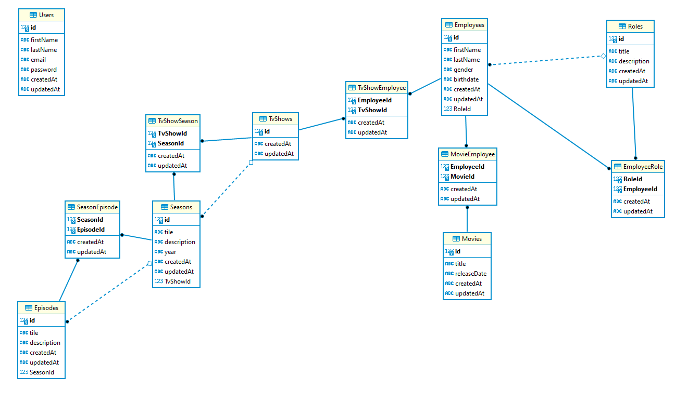

# Development Challenge for Node.js

This challenge aims to evaluate basic skills in Node.js development, and a bit of data/entity modeling. The idea is to build an HTTP REST API.

## Functionality

The API has to fulfill the following conditions:

- Endpoints for authentication using JWT. 
  Include an endpoint for refreshing the JWT access token.
- Endpoint for retrieving movies. 
  It should be allowed to filter and sort by some field.
- Endpoint for retrieving the information (director included) of a specific episode of a TV Show
- Endpoint for adding a new object (it could be for any entity you like).

### Model

Entities to consider:

- Movie 
  Has many actors, but one director.
- TV Show 
  Has many actors. It also has seasons and episodes inside each of one.
- Actor 
  Can be on different movies and tv shows.
- Director 
  Can direct many movies and specific episodes of tv shows.

#### Diagram

